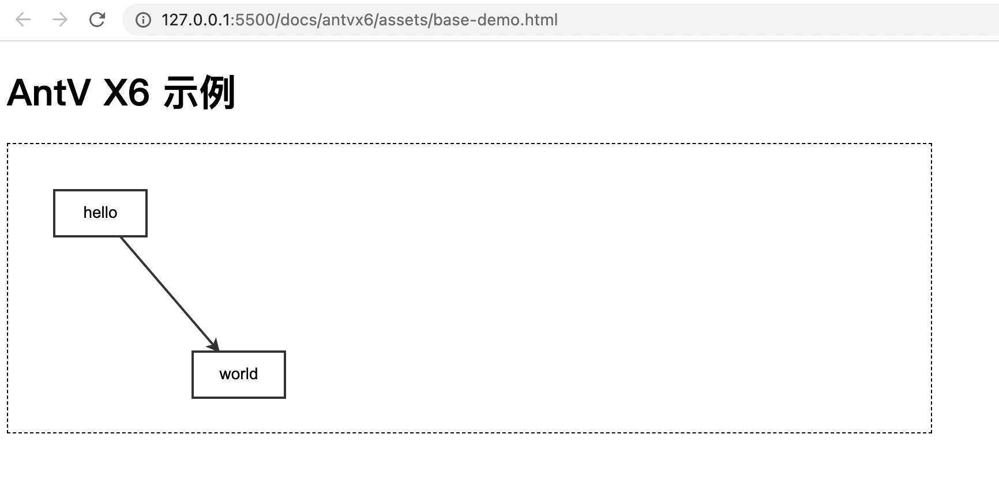

# 简介

> X6 是 AntV 旗下的图编辑引擎，提供了一系列开箱即用的交互组件和简单易用的节点定制能力，方便我们快速搭建流程图、DAG 图、ER 图等图应用。  
> 如果你还没有使用过 X6， 建议通过 [快速上手](https://antv-x6.gitee.io/zh/docs/tutorial/getting-started) 抢先体验 X6 的魅力。

## 基础示例

```html
<!DOCTYPE html>
<html lang="en">
<head>
  <meta charset="UTF-8">
  <meta http-equiv="X-UA-Compatible" content="IE=edge">
  <meta name="viewport" content="width=device-width, initial-scale=1.0">
  <title>基础示例</title>
  <script src="./x6.js"></script>
  <style>
    #container {
      border: 1px dashed black;
    }
  </style>
</head>
<body>
  <h1>AntV X6 示例</h1>

  <!-- 创建容器 -->
  <div id="container"></div>
  <script>
    // 准备模拟数据
    const data = {
      // 节点
      nodes: [
        {
          id: 'node1', // String，可选，节点的唯一标识
          x: 40,       // Number，必选，节点位置的 x 值
          y: 40,       // Number，必选，节点位置的 y 值
          width: 80,   // Number，可选，节点大小的 width 值
          height: 40,  // Number，可选，节点大小的 height 值
          label: 'hello', // String，节点标签
        },
        {
          id: 'node2', // String，节点的唯一标识
          x: 160,      // Number，必选，节点位置的 x 值
          y: 180,      // Number，必选，节点位置的 y 值
          width: 80,   // Number，可选，节点大小的 width 值
          height: 40,  // Number，可选，节点大小的 height 值
          label: 'world', // String，节点标签
        },
      ],
      // 边
      edges: [
        {
          source: 'node1', // String，必须，起始节点 id
          target: 'node2', // String，必须，目标节点 id
        },
      ],
    };

    // 渲染画布
    const graph = new X6.Graph({
      container: document.getElementById('container'),
      width: 800,
      height: 250
    })

    // 渲染数据
    graph.fromJSON(data)
  </script>
</body>
</html>
```

## 效果图


