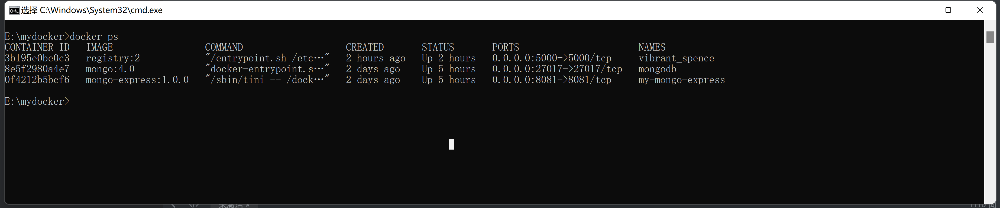
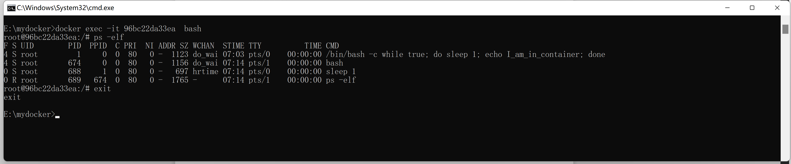

# 镜像构建

## **docker commit**

1. 运行容器
2. 修改容器
3. 将容器保存为新镜像

   ```bash
   docker commit [新镜像名称] [源镜像名称]
   ```

## **dockerfile文件构建**（推荐）

> `dockerfile`是一个文本文件，里边记录了构建镜像的所有步骤
>
> `dockerfile`支持以"#"开头的注释
>
> docker build 构建过程 默认会使用构建过镜像的缓存（镜像的缓存特性：构建镜像时，如果某镜像层已经存在，就直接使用，无需重新创建）
>
> docker build --no-cache[不使用缓存]
>
> `dockerfile`调试：可以在RUN 命令后边 echo “备注信息”，来查看命令执行到哪一步，进而排查问题。
>
> ```bash
> docker build -t [新镜像名称] [dockerfile文件]
> ### -t: 构建镜像名称
> ```

1. 从base镜像运行一个容器
2. 执行一条指令，修改容器
3. 执行类型docker commit 操作，生成一个新的镜像层
4. Docker 基于刚刚提交的镜像运行一个 新的容器
5. 重复 2 ~ 4 步骤，直至 `Dockerfile`中的所有指令执行完毕

   ```dockerfile
   # my dockerfile
   FROM busybox
   RUN touch tmpfile
   RUN /bin/bash -c echo "continue to build"
   COPY testfile/
   ```

### `Dockerfile`常用命令

```
FROM: 指定base镜像
MAINTAINER：设置镜像的作者，可以是任意字符
COPY：将文件从build context复制到镜像
	COPY支持两种形式： COPY src dest 与 COPY ["src", "dest"]
	注意：src只能指定build context 中的文件或者目录
ADD：将文件从build context复制到镜像
	ADD src dest 或者 ADD ["src", "dest"]
	区别COPY：如果src是归档文件（tar、zip、tgz、xz等）， 文件会被自动解压到dest
ENV：设置环境变量。环境变量会被后边的命令使用
	例如：ENV MY_VERSION 1.5 RUN apt-get install -y mypackage=$MY_VERSION
EXPOSE：指定容器中的进程会监听某个端口，Docker可以将该关口暴露出来
VOLUME：将文件或目录声明为volume
WORKDIR：为后面的RUN、CMD、ENTRYPOINT、ADD或COPY 指令设置镜像中的 当前工作目录
RUN：在容器中运行指定的命令
CMD：容器启动时运行指定的命令
	Dockerfile中可以有多个CMD指令，但是只有最后一个可以生效。CMD可以被docker run 之后的参数替换
ENTRYPOINT：设置容器启动时运行的命令
	Dockerfile可以有多个ENTRYPOINT命令，但只有最后一个生效。CMD或docker run后边的参数 会被当作参数传递给ENTRYPOINT
```

## 镜像构建并上传镜像

```bash
# 登录docker 账号，并输入密码
docker log -u [docker账号]
# 修改镜像的Repository, 使之与dockhub 账号匹配 tjrf/httpd:1 => [用户账号]/[image]:[指定tag]
docker tag http tjrf/httpd:1
# 通过docker push将镜像上传到Docker Hub
docker push tjrf/httpd:1
```

## 搭建本地Registry

> 镜像名称：repository + tag组成
>
> repository完整路径：[registry-host]:[port]/[username]/xxx
>
> 注意：只有Docker Hub上的镜像可以省略[registry-host]:[port]
>
> registry 支持 https安全传输等特性，可参照官方文档
>
> [DockerHub-https]: https://docs.docker.com/registry

```bash
# 启动Registry容器
docker run -d -p 5000:5000 -v /myregistry:/var/lib/registry registry:2
# docker tag 重命名镜像，使之与registry匹配 [registry.example.net 需要再host上配置本地对应的host，例如本地[127.0.0.1: registry.example.net]
docker tag tjrf/httpd:latest registry.example.net:5000/tjrf/httpd:latest
# docker push 上传到本地镜像
docker push registry.example.net:5000/tjrf/httpd:latest
# docker pull 拉取本地镜像
docker pull registry.example.net:5000/tjrf/httpd:latest
```

# Docker 容器

## 容器运行

### 容器长期运行



```bash
# 仅仅是启动容器，并未干实际的事情
docker run ubuntu /bin/bash -c 'while true; do sleep 1; done'
# -d 后台运行[推荐]
docker run ubuntu -d
# --name 为容器命名
docker run ubuntu -d --name my-ubuntu
```

### 停止容器

```bash
docker stop [CONTAINER_ID] # CONTAINTER_ID 容器ID
# 或者
docker stop [NAMES] # NAMES 容器名称
```

### 进入容器


1. docker attach

```bash
docker run -itd ubuntu /bin/bash -c "while true; do sleep 1; echo I_am_in_container; done"
docker attach [CONTAINER_ID]
# ctrl + p, ctrl + q 退出，必须以交互命令-it进入，否则无法退出
```



2. docker exec

   > -it：以交互模式打开 pseudo-TTY（虚拟交互终端，TTY（teletypewriter）），执行bash， 结果就是打开一个bash终端
   >
   > ps -elf：显示容器启动进程while以及当前的bash进程
   >
   > exit：退出容器
   >

   ```bash
   docker exec -it [CONTAINER_ID] bash|sh
   ```

#### docker attach VS docker exec

- docker attach 直接进入容器启动命令的中终端，不会启动新的进程。
- docker exec 是在容器中打开新的终端，并且可以启动新的进程。
- 希望直接在启动终端中查看命令的输出，使用attach, 其他则使用exec
- 可以直接使用docker logs -f [CONTAINER_ID]查看命令输出。-f，类似tail -f ，持续打印输入

# Docker网络

# Docker 存储

# 每日命令

1. `-it`

   ```bash
   -it: 以交互模式进入容器，并打开终端
   ```
2. docker history

   ```bash
   docker history: 查看镜像的构建历史（过程）
   ```
3. docker tag 给镜像打tag

   ```
   docker tag [当前镜像] [新镜像名称]:[tag名称]
   例如：docker tag mongo:latest my_mongo:1.0.0
   ```
4. docker rmi 删除本地host镜像

   > 1. 只删除host的镜像，不会删除registry的镜像
   > 2. 如果镜像有多个tag，只有删除了所有的对应的tag的镜像，镜像才真正被删除，否则只是删除了镜像对应的tag
   >

   ```bash
   docker rmi registry.example.net:5000/tjrf/httpd:latest
   ```
5. docker search  搜索Docker Hub中的镜像

   ```bash
   docker search httpd
   ```
6. docker ps [ docker container ls ] 查看当前Docker host 中运行的 container

   ```bash
   # 查看运行中的container
   docker ps
   # 或者
   docker container ls
   # 查看所有状态的container
   docker ps -a
   docker container ls -a
   ```
